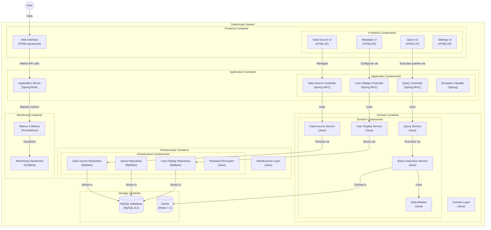

# DataScope 系统架构设计

## 整体架构

系统采用前后端分离的模块化架构，主要分为以下几个部分：

### 前端架构

- 基于HTML + Tailwind CSS构建
- 使用FontAwesome图标库
- 采用模块化组件设计
- 支持响应式布局

### 后端架构

- 采用DDD领域驱动设计
- 基于SpringBoot框架
- 使用Maven多模块管理
- 遵循SOLID设计原则

## 模块划分

### data-scope-app (应用层)

- 处理HTTP请求响应
- 实现接口控制器
- 处理全局异常
- 配置系统参数
- 实现接口限流

### data-scope-domain (领域层)

- 实现核心业务逻辑
- 定义领域模型
- 定义领域服务
- 定义仓储接口
- 处理业务异常

### data-scope-facade (门面层)

- 定义外部服务接口
- 实现DTO转换
- 封装业务操作
- 处理跨领域调用

### data-scope-infrastructure (基础设施层)

- 实现数据持久化
- 实现缓存管理
- 实现消息队列
- 实现第三方集成
- 提供技术支持

### data-scope-main (启动模块)

- 提供应用入口
- 配置系统环境
- 管理依赖注入
- 初始化资源

## 核心功能模块

### 数据源管理模块

- 数据源配置管理
- 元数据同步管理
- 连接池管理
- 密码加密存储

### 查询管理模块

- SQL查询执行
- 自然语言处理
- 查询优化建议
- 查询历史记录

### 显示配置模块

- 用户偏好设置
- 界面布局配置
- 数据展示规则
- 掩码规则管理

### 系统集成模块

- API接口管理
- 低代码平台集成
- 权限认证管理
- 数据导出功能

## 技术架构

### 开发框架

- Java 8+
- Spring Boot 2.7+
- MyBatis 3.5+
- Redis 6.0+

### 数据存储

- MySQL 8.0+
- Redis缓存
- 本地文件存储

### 系统监控

- Spring Boot Actuator
- Prometheus监控
- Grafana可视化

### 开发工具

- Maven 3.6+
- Git版本控制
- Docker容器化
- Jenkins CI/CD

## 安全架构

### 访问控制

- 基于JWT的认证
- 基于RBAC的授权
- API访问限流
- 敏感数据加密

### 数据安全

- 密码加盐加密
- 数据传输加密
- 敏感数据脱敏
- 操作日志审计

## 部署架构

### 开发环境

- 本地开发环境
- 代码质量检查
- 单元测试覆盖
- 接口自动测试

### 测试环境

- 集成测试环境
- 性能测试环境
- 自动化测试
- 缺陷跟踪

### 生产环境

- 应用服务器集群
- 数据库主从架构
- Redis集群
- 负载均衡

## 扩展性设计

### 水平扩展

- 应用服务无状态
- 分布式缓存
- 分布式会话
- 负载均衡

### 垂直扩展

- 模块化设计
- 插件化架构
- 配置化开发
- 服务化集成

### 可扩展点

- 数据源类型
- 查询引擎
- 展示组件
- 集成接口
