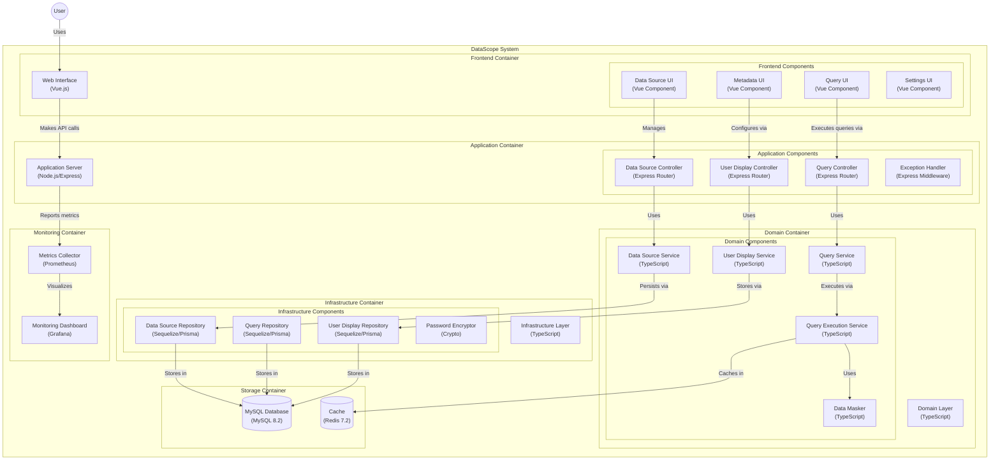

# DataScope Node技术架构

## 整体架构

系统采用前后端分离的模块化架构，主要分为以下几个部分：

## 前端架构

- 基于Vue 3框架
- 使用Composition API
- TypeScript语言支持
- Pinia状态管理
- Vue Router路由管理
- Vite构建工具
- Tailwind CSS样式框架
- FontAwesome图标库
- 组件化设计
- 响应式布局

## 后端架构

- Node.js运行环境
- Express框架
- TypeScript语言
- 分层架构设计
- 采用DDD领域驱动思想
- 模块化组织代码
- ORM: Sequelize/Prisma
- 遵循SOLID设计原则

## 模块划分

### data-scope-api (API层)

- Express路由控制器
- 请求验证
- 响应格式化
- 全局异常处理
- 接口限流

### data-scope-service (服务层)

- 业务逻辑实现
- 数据转换处理
- 事务管理
- 领域服务调用

### data-scope-domain (领域层)

- 实现核心业务逻辑
- 定义领域模型
- 定义领域服务
- 定义仓储接口
- 处理业务异常

### data-scope-repository (仓储层)

- 数据持久化
- ORM映射实现
- 数据查询优化
- 数据库交互

### data-scope-common (公共层)

- 工具类
- 常量定义
- 配置管理
- 日志处理

### data-scope-web (前端应用)

- Vue组件
- 路由定义
- 状态管理
- API调用
- UI组件库

## 技术架构

### 开发框架

- Node.js 18+
- Express 4.x
- Vue 3.x
- TypeScript 5.x

### 数据存储

- MySQL 8.0+
- Redis缓存
- Sequelize/Prisma ORM
- 本地文件存储

### 系统监控

- Express Metrics
- Prometheus监控
- Grafana可视化

### 开发工具

- npm/yarn/pnpm
- Git版本控制
- Docker容器化
- GitHub Actions CI/CD

## 安全架构

### 访问控制

- 基于JWT的认证
- 基于RBAC的授权
- API访问限流
- 敏感数据加密

### 数据安全

- 密码加盐加密
- 数据传输加密
- 敏感数据脱敏
- 操作日志审计

## 部署架构

### 开发环境

- 本地开发环境
- 代码质量检查
- 单元测试覆盖
- 接口自动测试

### 测试环境

- 集成测试环境
- 性能测试环境
- 自动化测试
- 缺陷跟踪

### 生产环境

- 应用服务器集群
- 数据库主从架构
- Redis集群
- 负载均衡

## 扩展性设计

### 插件化架构

- 动态加载模块
- 插件注册机制
- 配置驱动功能
- 自定义扩展点

### 微服务兼容

- 服务注册发现
- 配置中心集成
- 分布式日志
- 链路追踪